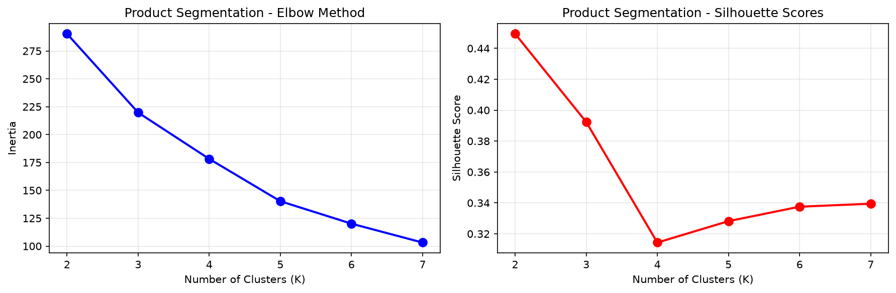
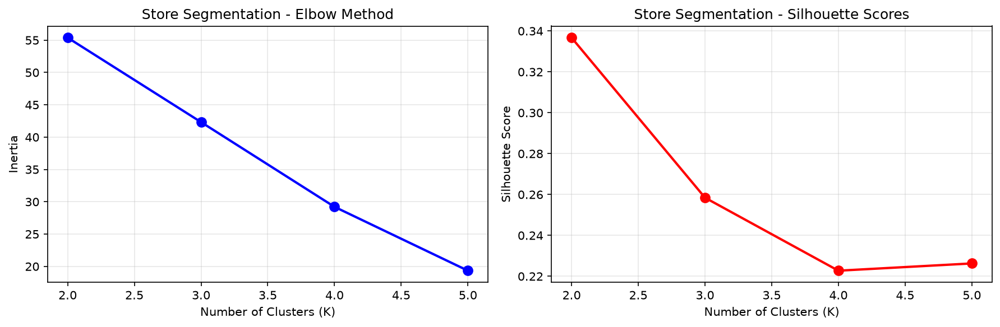
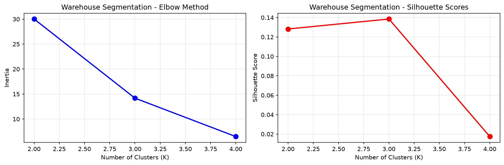
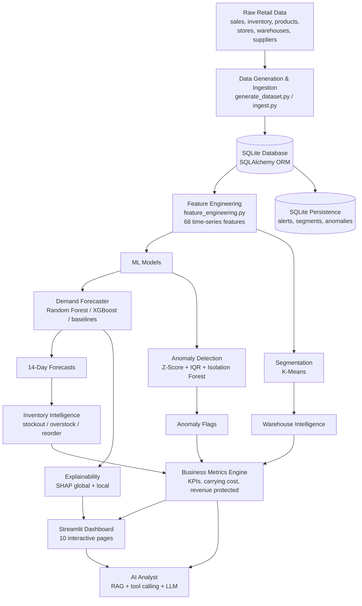
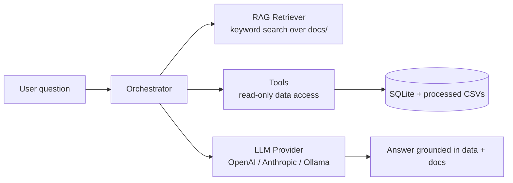

# RetailSync AI

> **AI-Powered Retail Demand Forecasting & Supply-Chain Intelligence Platform**

[](https://www.python.org/)
[](https://streamlit.io/)
[](https://xgboost.ai/)
[](https://scikit-learn.org/)
[](https://pandas.pydata.org/)
[](https://plotly.com/)
[](https://www.docker.com/)
[](https://github.com/ARJUN-0402/RetailSync-AI/actions/workflows/ci.yml)
[](LICENSE)

**RetailSync AI** is an end-to-end machine learning platform that turns raw retail
operations data into demand forecasts, inventory-risk signals, anomaly alerts,
customer/store/warehouse segments, and an interactive decision-support dashboard —
augmented by a retrieval-augmented (RAG) AI analyst that answers business questions
in natural language.

🔗 **Repository:** [github.com/ARJUN-0402/RetailSync-AI](https://github.com/ARJUN-0402/RetailSync-AI)

---

## 📋 Table of Contents

- [What is RetailSync AI?](#what-is-retailsync-ai)
- [Why it matters](#why-it-matters)
- [Business problem](#business-problem)
- [Key capabilities](#key-capabilities)
- [Visualizations](#visualizations)
- [Live demo](#live-demo)
- [Architecture](#architecture)
- [Technology stack](#technology-stack)
- [Machine learning methodology](#machine-learning-methodology)
- [Model performance](#model-performance)
- [Explainability (SHAP)](#explainability-shap)
- [Business KPIs](#business-kpis)
- [AI Analyst](#ai-analyst)
- [Project structure](#project-structure)
- [Installation](#installation)
- [Local development](#local-development)
- [Docker](#docker)
- [Environment variables](#environment-variables)
- [Testing](#testing)
- [Deployment](#deployment)
- [Project limitations](#project-limitations)
- [Roadmap](#roadmap)
- [Author](#author)
- [License](#license)

---

## What is RetailSync AI?

RetailSync AI is a portfolio-grade data-science application that demonstrates a
complete, production-shaped ML pipeline:

**Data → Preprocessing → Feature Engineering → ML Models → Business Intelligence →
SQLite Persistence → Streamlit Dashboard → AI Analyst**

It covers the full retail analytics lifecycle — from a synthetic but realistic
point-of-sale and inventory dataset, through 68 engineered time-series features and
a benchmarked forecasting model, to inventory risk, anomaly detection, K-Means
segmentation, warehouse utilization, and a multi-page Streamlit dashboard. A RAG
layer over the project's own documentation and data tools lets stakeholders ask
plain-English questions ("Which products are overstocked?", "Why is demand expected
to rise next week?").

The project emphasizes **honest evaluation**: model selection is automatic and
metric-driven, every KPI is computed from real artifacts (not hard-coded), and
limitations (e.g. synthetic data, zero-inflation) are documented openly.

## Why it matters

Retailers lose revenue to two opposite failure modes: **stockouts** (missed sales)
and **overstock** (tied-up capital, holding cost, obsolescence). Both are driven by
poor demand visibility. RetailSync AI shows how modern ML tooling addresses this:

- Forecast future demand at the product–store–day level (14-day horizon).
- Quantify stockout and overstock exposure with configurable cost models.
- Surface unusual demand patterns automatically (spikes, drops, multivariate outliers).
- Segment products, stores, and warehouses to tailor strategy.
- Explain model predictions to non-technical stakeholders with SHAP.
- Let managers query the system conversationally via an LLM-powered analyst.

---

## Business problem

| Problem | How RetailSync AI addresses it |
|---------|-------------------------------|
| **Demand forecasting** | Benchmarks baselines vs. Random Forest / XGBoost on a time-based split; produces 14-day product–store forecasts. |
| **Stockouts** | Inventory intelligence flags HIGH/MEDIUM stockout risk and computes urgent reorder recommendations with safety stock + lead time. |
| **Overstock** | Detects overstock risk (HIGH/MEDIUM) and quantifies excess inventory value above configured ceilings. |
| **Anomaly detection** | Ensemble of Rolling Z-Score + IQR + Isolation Forest flags demand spikes, drops, and unusual multivariate patterns. |
| **Segmentation** | K-Means groups products, stores, and warehouses into actionable behavioral segments. |
| **Warehouse intelligence** | Analyzes occupied vs. capacity volume, utilization %, turnover, and capacity risk with recommendations. |

---

## Key capabilities

Implemented and verified in the codebase:

- **Demand forecasting** — compares Historical Mean, Naïve, 7-day Moving Average,
  Random Forest, and XGBoost; selects the best by validation MAE; generates 14-day forecasts.
- **Inventory intelligence** — per product–store risk scoring: stockout risk,
  overstock risk, dead-stock detection, reorder urgency, and a 0–100 composite risk score.
- **Anomaly detection** — ensemble of Rolling Z-Score, IQR, and Isolation Forest;
  an anomaly is confirmed when 2+ methods agree.
- **Segmentation** — K-Means for products, stores, and warehouses with silhouette-based K selection.
- **Warehouse intelligence** — capacity, utilization, turnover, and capacity-risk analysis.
- **Explainability** — SHAP (TreeExplainer) global + local feature attribution with
  auto-generated plain-English explanations.
- **Business KPIs** — forecast accuracy, inventory carrying cost, stockout cost,
  overstock value, potential revenue protected, and reorder recommendations.
- **AI Analyst** — RAG + tool-calling natural-language interface over retail data.
  The current implementation provides **deterministic, rule-based responses** driven by
  read-only data tools (stockout risks, overstock, reorders, anomalies, forecasts,
  revenue, segments, KPIs, SHAP explanations). An optional **LLM provider**
  (OpenAI / Anthropic / Ollama) can be enabled via `RETAILSYNC_AI_API_KEY` for
  generative answers; without the key the analyst still answers questions using the
  rule-based engine, and the rest of the dashboard is unaffected.
- **Dashboard** — multi-page Streamlit app (Overview, Demand Forecast, Inventory,
  Anomalies, Segmentation, Warehouse, Data Explorer, Model Performance, AI Analyst, Explainability).
- **Production hygiene** — centralized config, structured logging with secret
  redaction, validation, typed exceptions, health checks, Docker, and CI.

---

## Visualizations

The repository ships real model-diagnostic figures generated by the clustering
pipeline (elbow plots used for K selection). Dashboard screenshots are **not**
committed to the repo; run the app locally to explore the interactive pages.

**K-Means elbow analysis (K selection via silhouette + elbow):**

| Products | Stores | Warehouses |
|----------|--------|------------|
|  |  |  |

*Figures generated by `src/clustering/segmentation.py`.*

---

## Live demo

A hosted live demo is **not currently available**. Run the dashboard locally
(see [Installation](#installation) and [Local development](#local-development)) —
it is served at **http://localhost:8501** after `streamlit run dashboard/app.py`.

---

## Architecture



*Layers mirror the layered design in `docs/architecture.md` (Data → Feature →
Model → Intelligence → Presentation) with an added explainability and AI-analyst tier.*

---

## Technology stack

| Category | Technologies |
|----------|--------------|
| **Languages** | Python 3.11+ |
| **ML** | Scikit-learn, XGBoost, Statsmodels, SHAP |
| **Data** | Pandas, NumPy, SQLAlchemy |
| **Visualization** | Plotly, Matplotlib |
| **App** | Streamlit |
| **Database** | SQLite (SQLAlchemy ORM) |
| **Model serialization** | Joblib |
| **AI / LLM** | OpenAI, Anthropic, Ollama (via RAG + tool-calling) |
| **DevOps / CI** | Docker, Docker Compose, GitHub Actions |
| **Testing / Lint** | pytest, ruff |

---

## Machine learning methodology

### Data source & generation
A reproducible synthetic dataset is generated by `src/data/generate_dataset.py`
(realistic but fictional — see [Limitations](#project-limitations)):

- **50 products**, **10 stores**, **8 suppliers**, **5 warehouses**
- **730 days** of history (2023-08-11 → 2025-08-09)
- **365,000** daily product–store sales records and **52,500** inventory snapshots
- Ingested and validated into a 12-table SQLite database (`src/database/init_db.py`)

### Preprocessing & feature engineering
`src/features/feature_engineering.py` builds **68 predictive features** per
product–store–day observation with **time-safe** (leakage-free) logic:

- Lag features (1d, 7d, 14d, 28d)
- Rolling statistics (7d, 14d, 28d)
- Expanding statistics
- Cyclical time features
- Price & promotion features
- Inventory features
- Demand-variability features
- Forecast targets (1d / 7d / 14d ahead)

### Train / validation / test strategy
A strict **time-based split** prevents leakage:

| Split | Date range | Rows | Purpose |
|-------|------------|------|---------|
| Train | ≤ 2024-12-31 | 254,500 | Model training |
| Validation | 2025-01-01 → 2025-06-09 | 80,000 | Hyperparameter / model selection |
| Test | 2025-06-10 → 2025-08-09 | 30,500 | Final evaluation |

### Models evaluated
Baselines (Historical Mean, Naïve, 7-day Moving Average) and ML models
(Random Forest: 100 trees / max_depth 15; XGBoost: 100 estimators / max_depth 8).

### Evaluation metrics
MAE, RMSE, R², and sMAPE. MAE on the validation set is the primary selection
criterion; per-product / per-store / per-category breakdowns are also produced.

### Model selection
The model with the **lowest validation MAE** is automatically selected and
serialized to `models/demand_forecaster.pkl`. On the current dataset this is
**Random Forest** (see [Model performance](#model-performance)).

---

## Model performance

### Model comparison (validation set, current dataset)

| Model | MAE ↓ | RMSE ↓ | R² | sMAPE (%) |
|-------|------:|-------:|---:|----------:|
| Historical Mean (baseline) | 5.9054 | 10.4848 | -0.0748 | 53.44 |
| Naïve (previous day) | 6.4587 | 12.1243 | -0.4372 | 53.92 |
| Moving Average (7-day) | 5.0153 | 9.1597 | 0.1797 | 43.58 |
| XGBoost | 4.7685 | 8.8419 | 0.2356 | 41.41 |
| **Random Forest (selected)** | **4.6660** | **8.7103** | **0.2582** | **41.24** |

### Selected model — test-set performance

| Metric | Value |
|--------|------:|
| Model | Random Forest (100 trees, max_depth 15) |
| Test MAE | 4.6482 |
| Test RMSE | 8.2912 |
| Test R² | 0.2222 |
| Test sMAPE | 46.83% |
| Forecast horizon | 14 days (product–store–day) |
| 14-day forecast volume | ~69,465 units |
| 14-day forecast revenue | ~$16.13M |

> **Honest note:** model selection is data-dependent and driven by validation MAE.
> The current generator produces a dataset where roughly **1.2%** of daily
> product–store demand is zero; the ML models beat every baseline on
> MAE/RMSE/R²/sMAPE. Aggregating to weekly/monthly horizons or using zero-inflated
> models would improve performance further (see [Roadmap](#roadmap)).

### Top features (Random Forest importance)

| Rank | Feature | Importance |
|------|---------|----------:|
| 1 | `demand_rolling_median_28d` | 55.6% |
| 2 | `demand_expanding_mean` | 3.4% |
| 3 | `category_avg_demand` | 1.9% |
| 4 | `demand_expanding_std` | 1.5% |
| 5 | `store_type_avg_demand` | 1.4% |

*Source: `docs/feature_importance.csv` (generated by the forecaster).*

---

## Explainability (SHAP)

The `src/explainability/` module adds a training-agnostic SHAP layer
(`shap.TreeExplainer` for tree models) that answers three questions:

1. **Global** — which features drive demand predictions overall (mean \|SHAP\| ranking + beeswarm).
2. **Local** — why a *specific* forecast is what it is (per-feature SHAP + waterfall).
3. **Directional** — auto-generated plain-English explanation built from real feature
   values vs. background median (no hard-coded text).

It reuses the trained `models/demand_forecaster.pkl`, never retrains, and degrades
gracefully if SHAP or the model is missing. Exposed both on the **Model
Explainability** page and as a "Why this forecast?" panel on the Demand Forecast page.

---

## Business KPIs

All KPIs are computed live from data artifacts by `src/business_metrics/` (no
hard-coded values). Definitions follow the implementation:

| KPI | What it computes | Basis |
|-----|------------------|-------|
| **Forecast accuracy** | MAE, RMSE, sMAPE, bias on the test set; per-product/store/category breakdowns | `kpi.compute_forecast_accuracy` |
| **Inventory carrying cost** | `total_inventory_value × carrying_cost_pct × (period/365)` | `kpi.compute_inventory_carrying_cost` |
| **Stockout cost** | Estimated lost revenue & cost from HIGH/MEDIUM stockout-risk items | `kpi.compute_stockout_cost` |
| **Overstock value** | Excess units above `max_stock_level` × cost price | `kpi.compute_overstock_value` |
| **Potential revenue protected** | Avoided stockout revenue + recovered overstock margin (× confidence) | `kpi.compute_potential_revenue_protected` |
| **Reorder recommendations** | Recommended qty = reorder point − on hand; urgency from coverage days; includes safety stock & lead time | `reorder.generate_reorder_recommendations` |

> Cost/margin assumptions (e.g. 25% annual carrying cost, stockout cost rate, 30%
> recovered-overstock margin) are **configurable** in `src/business_metrics/config.py`
> and clearly flagged as estimates in the UI — they are illustrative, not audited figures.

### Current intelligence snapshot (from pipeline artifacts)

| Area | Result |
|------|-------:|
| Product–store combinations analyzed | 500 |
| Stockout risk (HIGH / MEDIUM) | 10 / 21 |
| Overstock risk (HIGH) | 58 |
| Urgent reorders | 31 |
| Anomalies detected | 13,522 (3.7%) — 12,433 spikes, 1,089 unusual patterns |
| Warehouses analyzed | 5 (avg utilization 55.4%, capacity 49,835 m³) |

---

## AI Analyst

`src/ai_analyst/` adds a **read-only** natural-language layer on top of the data and models:



- **RAG**: retrieves top-k documentation chunks (`docs/*.md`) and injects them as context.
- **Tools** (12 read-only): `get_sales_trends`, `get_forecasts`, `get_inventory_snapshot`,
  `get_stockout_risks`, `get_overstock_risks`, `get_anomalies`, `get_product_segments`,
  `get_store_segments`, `get_warehouse_performance`, `get_executive_kpis`,
  `get_reorder_recommendations`, `get_forecast_explanation`.
- **Providers**: OpenAI (`gpt-4o-mini` default), Anthropic, Ollama; **offline mode**
  falls back to rule-based summaries when no LLM key is set.
- The analyst is strictly read-only and never modifies inventory or data.

---

## Project structure

```text
RetailSync-AI/
├── .github/workflows/ci.yml        # Lint + test (py3.11–3.13) + Docker build
├── dashboard/
│   ├── app.py                      # Streamlit entrypoint
│   ├── business_intelligence.py
│   ├── explainability_page.py
│   ├── components/ui.py
│   └── pages/                      # overview, demand_forecast, inventory,
│                                   # anomalies, segmentation, warehouse,
│                                   # data_explorer, model_performance, ai_analyst
├── src/
│   ├── config.py  exceptions.py  health.py
│   ├── ai_analyst/                # orchestrator, retriever, tools, prompts, config
│   ├── anomaly/                   # anomaly_detection.py
│   ├── business_metrics/          # kpi, reorder, config, utils
│   ├── clustering/                # segmentation, warehouse_optimization
│   ├── data/                      # generate_dataset, ingest
│   ├── database/                  # init_db
│   ├── explainability/            # shap_explainer, explanation, visualizations, ...
│   ├── features/                  # feature_engineering
│   ├── forecasting/               # demand_forecaster, forecast_pipeline
│   ├── inventory/                 # inventory_intelligence, load_alerts
│   ├── models/                    # baselines
│   ├── pipeline/                  # run_pipeline (validation/reports)
│   └── utils/                     # validation, logging
├── data/raw/  data/processed/     # inputs + pipeline outputs
├── models/                        # serialized .pkl artifacts
├── database/                      # schema.sql, queries.sql, retailsync.db
├── docs/                          # methodology, architecture, elbow plots
├── tests/                         # pytest suites
├── notebooks/                     # EDA notebooks + outputs
├── logs/  Dockerfile  docker-compose.yml
├── requirements.txt  pyproject.toml  .env.example  README.md  LICENSE
```

---

## Installation

### Prerequisites
- Python 3.11+
- pip
- Git
- (optional) Docker + Docker Compose

### Steps

```bash
# Clone
git clone https://github.com/ARJUN-0402/RetailSync-AI.git
cd RetailSync-AI

# Virtual environment
python -m venv venv
# Windows:
venv\Scripts\activate
# macOS / Linux:
source venv/bin/activate

# Install dependencies
pip install -r requirements.txt
```

> **Path note:** several `src/` modules import the top-level `src` package.
> If you see `ModuleNotFoundError: No module named 'src'`, run the pipeline
> commands from the repository root with the repo on the path:
> `export PYTHONPATH=.` (macOS/Linux) or `set PYTHONPATH=.` (Windows),
> or use `python -m src.<module>.<script>`.

---

## Local development

### 1. Generate & ingest data
```bash
python src/data/generate_dataset.py
python src/data/ingest.py
python src/database/init_db.py
```

### 2. Feature engineering
```bash
python src/features/feature_engineering.py
```

### 3. Train model & generate forecasts
```bash
python src/forecasting/demand_forecaster.py
python src/forecasting/forecast_pipeline.py
```

### 4. Intelligence layers
```bash
python src/inventory/inventory_intelligence.py
python src/inventory/load_alerts.py
python src/anomaly/anomaly_detection.py
python src/clustering/segmentation.py
python src/clustering/warehouse_optimization.py
```

Optional end-to-end validation/report:
```bash
python src/pipeline/run_pipeline.py
```

### 5. Launch the dashboard
```bash
streamlit run dashboard/app.py
# Open http://localhost:8501
```

> The dashboard reads from `data/processed/*.csv` and `models/*.pkl`. Run steps 1–4
> (or `python src/pipeline/run_pipeline.py` after they complete) before launching.

### Configuration
Centralized in `src/config.py` (database path, data/metadata paths, app settings).
Copy `.env.example` → `.env` to override (see [Environment variables](#environment-variables)).
Logs are written to `logs/retailsync.log` with secret redaction.

---

## Docker

### Build & run (single container)
```bash
docker build -t retailsync-ai .
docker run -p 8501:8501 \
  -v "$(pwd)/data:/app/data" \
  -v "$(pwd)/models:/app/models" \
  -v "$(pwd)/database:/app/database" \
  retailsync-ai
```

### Docker Compose
```bash
docker-compose up --build
# Dashboard: http://localhost:8501
```

The image is multi-stage, runs as a non-root user, and includes a `/health`
healthcheck (`src/health.py`).

---

## Environment variables

Copy `.env.example` to `.env` and edit as needed. **Never commit `.env`.**

| Variable | Default | Purpose |
|----------|---------|---------|
| `DATABASE_URL` | `sqlite:///database/retailsync.db` | DB connection |
| `DATABASE_PATH` | `database/retailsync.db` | DB file path |
| `APP_NAME` / `APP_VERSION` | `RetailSync AI` / `2.0.0` | App metadata |
| `APP_ENV` / `APP_DEBUG` | `development` / `false` | Runtime mode |
| `RAW_DATA_PATH` / `PROCESSED_DATA_PATH` | `data/raw` / `data/processed` | Data dirs |
| `MODELS_PATH` | `models` | Model dir |
| `STREAMLIT_SERVER_PORT` / `STREAMLIT_SERVER_ADDRESS` | `8501` / `0.0.0.0` | Dashboard bind |
| `LOG_LEVEL` / `LOG_FILE` | `INFO` / `logs/retailsync.log` | Logging |
| `RETAILSYNC_AI_API_KEY` | _(empty)_ | LLM provider key |
| `RETAILSYNC_AI_PROVIDER` | `openai` | `openai` / `anthropic` / `ollama` |
| `RETAILSYNC_AI_MODEL` | `gpt-4o-mini` | LLM model name |
| `RETAILSYNC_AI_BASE_URL` | _(empty)_ | Optional proxy / Ollama URL |
| `RETAILSYNC_AI_OFFLINE_MODE` | `false` | Rule-based fallback if `true` |
| `RETAILSYNC_AI_DISABLE_TOOLS` | `false` | Disable tool calling |
| `RETAILSYNC_AI_DISABLE_RAG` | `false` | Disable doc retrieval |

*No secrets are stored in the repository; all keys are supplied via environment.*

---

## Testing

```bash
# Run the full test suite
pytest tests/ -v

# Run a single suite
pytest tests/test_forecasting.py -v

# Coverage
pytest tests/ --cov=src --cov-report=html

# Lint (matches CI)
ruff check src/ tests/ dashboard/ --select E,F --ignore E501
```

### CI/CD
GitHub Actions (`.github/workflows/ci.yml`) runs on push/PR:
1. **Lint** — `ruff` on `src/`, `tests/`, `dashboard/`.
2. **Test** — `pytest` across Python **3.11, 3.12, 3.13**.
3. **Build** — validates the Docker image build.


---

## Deployment

Tested / supported methods:

- **Local (Python):** run the pipeline, then `streamlit run dashboard/app.py`.
- **Docker:** `docker build` + `docker run` (or `docker-compose up --build`) as shown above.
- **Cloud container platforms** (AWS ECS/Fargate, GCP Cloud Run, Azure Container
  Instances) are documented in `docs/deployment.md` and are compatible with the
  provided Docker image, but are **not pre-configured** in this repo.

SQLite is used for development; the docs note a PostgreSQL migration path for
concurrent/multi-user production deployments.

---

## Project limitations

Documented honestly:

- **Synthetic data** — the dataset is generated, not real retail transactions; absolute
  numbers illustrate the pipeline rather than real business outcomes.
- **Zero-inflation** — only ~1.2% of daily product–store demand is zero, thanks to
  the improved demand generator; the dataset retains realistic demand patterns with
  trend, seasonality, and promotional effects.
- **Granularity** — daily product–store forecasting is noisy; weekly/monthly aggregation
  would improve signal.
- **No external features** — weather, holidays, promotions context, and local events are
  not modeled (promotion flags exist but external signals are absent).
- **Static snapshots** — clustering and warehouse optimization use historical snapshots,
  not streaming data.
- **AI/LLM limits** — the analyst is read-only, keyword-based RAG (may miss abstract
  queries), and offline mode returns rule-based summaries rather than LLM prose.
- **Cost KPIs are estimates** — carrying/stockout/overstock figures use configurable
  assumptions and are illustrative, not audited.

---

## Roadmap

Future improvements (not yet implemented):

- Replace synthetic data with real retail datasets.
- Add external features: weather, holidays, promotions, local events.
- Advanced forecasting: Temporal Fusion Transformers, N-BEATS, LSTM, zero-inflated / hurdle models.
- Probabilistic forecasting with uncertainty quantification.
- Richer agentic workflows (multi-step planning, self-correction) for the AI Analyst.
- Real-time ingestion pipelines (e.g. Kafka / streaming).
- Cloud auto-scaling, authentication, multi-tenancy, model monitoring & automated retraining (MLflow).
- Expand dashboard test/visual coverage and add model-version management.

---

## Author

**RetailSync AI** — an AI/ML portfolio project by **ARJUN-0402**.

- GitHub: [@ARJUN-0402](https://github.com/ARJUN-0402)
- Repository: [RetailSync-AI](https://github.com/ARJUN-0402/RetailSync-AI)
- Version: 2.0.0

---

## License

Released under the **MIT License** — see the [LICENSE](LICENSE) file for full text.

© 2026 RetailSync AI
