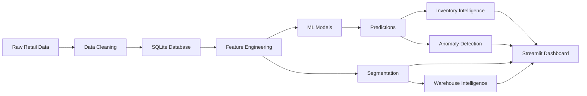

# RetailSync AI

## AI-Powered Retail Demand Forecasting & Supply Chain Intelligence Platform


> An end-to-end retail analytics platform combining demand forecasting, inventory intelligence, anomaly detection, segmentation, and warehouse analytics into an interactive Streamlit dashboard.

---

## Business Problem

Retailers face persistent supply-chain challenges that directly impact profitability: inaccurate demand forecasts lead to both stockouts (lost sales) and overstock (carrying costs), while dead inventory ties up capital indefinitely. Unusual demand patterns go undetected until they cause problems, and warehouse capacity is often invisible until it is too late. Operational data is fragmented across inventory systems, point-of-sale logs, and supplier records, making holistic decision-making difficult.

RetailSync AI addresses these challenges through a unified data science pipeline that generates synthetic retail data with realistic patterns, engineers 74 time-safe features, compares forecasting approaches, detects inventory risks, identifies demand anomalies, segments business entities, and analyzes warehouse utilization — all surfaced through an interactive dark-themed dashboard.


---

## Key Capabilities

### Demand Forecasting

Compares multiple forecasting approaches on daily product-store demand with time-based train/validation/test splits and time-aware validation:

- **Historical Mean** (baseline)
- **Naive** (last-known value)
- **Moving Average** (7-day rolling window)
- **Random Forest** (100 trees, max depth 15)
- **XGBoost** (100 trees, max depth 8)

Evaluation metrics: MAE, RMSE, R², sMAPE. The best-performing approach is selected and used to generate 14-day forward forecasts.

### Inventory Intelligence

Rule-based risk detection for every product-store combination at the latest inventory snapshot:

- **Stockout risk** (HIGH / MEDIUM / LOW) — based on current inventory vs. reorder point and forecasted demand
- **Overstock risk** (HIGH / MEDIUM / LOW) — based on inventory relative to max stock level and demand variability
- **Dead stock** — high inventory with zero recent demand or zero coefficient of variation
- **Reorder urgency** (URGENT / SOON / MONITOR / NONE) — based on coverage days and reorder point proximity
- **Composite risk score** (0–100) — weighted combination of all risk dimensions with actionable recommendations

### Anomaly Detection

Ensemble detection combining three complementary methods:

- **Rolling Z-score** — univariate spikes and drops relative to a 30-day rolling mean/std
- **IQR method** — distribution-based outlier detection per product-store
- **Isolation Forest** — multivariate anomaly detection on aggregate product-store features

An anomaly is flagged when **2 or more methods agree**, reducing false positives. Each anomaly includes a Z-score, anomaly type (Demand Spike, Demand Drop, Unusual Pattern), and the methods that voted for it.

### Segmentation

K-Means clustering with optimal-K selection via silhouette score for three entity types:

- **Products** (K=2) — segmented by revenue, demand variability, and zero-demand proportion
- **Stores** (K=2) — segmented by revenue, demand variability, and store type
- **Warehouses** (K=4) — segmented by utilization, stock coverage, and turnover

Business labels are derived from actual cluster characteristics (e.g., "Slow-Moving", "High-Performance", "Overstocked").

### Warehouse Intelligence

Descriptive analytics and recommendation engine for warehouse utilization:

- Occupied volume and capacity analysis per warehouse
- Utilization percentage classification (HIGH >80%, MEDIUM 50–80%, LOW <50%)
- Inventory turnover ratios
- Capacity risk assessment
- Actionable recommendations (expand, consolidate, maintain)

> **Note:** The warehouse module performs descriptive analytics and rule-based recommendations. It does not use a formal optimization algorithm (e.g., linear programming solver).

### Interactive Dashboard

A 7-page Streamlit application with a dark enterprise theme:

1. **Executive Overview** — KPI cards, model status, business problem context
2. **Demand Forecast** — interactive product-store forecast charts with historical comparison
3. **Inventory Intelligence** — risk distribution pies, critical item table, alert filter
4. **Demand Anomalies** — anomaly timeline, top anomalous products, anomaly detail table
5. **Segmentation** — cluster distributions and scatter plots for products, stores, warehouses
6. **Warehouse Intelligence** — utilization bars, warehouse detail table, recommendations
7. **Data Explorer** — raw data table viewer for all database tables

All charts use Plotly for interactivity. All metrics are computed dynamically from CSV files and SQLite — no hardcoded values.

---

## Architecture



### Pipeline Layers

| Layer | Components |
|-------|-----------|
| **Data Layer** | `generate_dataset.py`, `ingest.py` — synthetic data generation and cleaning |
| **Feature Layer** | `feature_engineering.py` — 74 features (lags, rolling stats, time features, inventory, targets) |
| **Model Layer** | `demand_forecaster.py` — forecasting model training; `segmentation.py` — K-Means clusterers |
| **Intelligence Layer** | `forecast_pipeline.py`, `inventory_intelligence.py`, `anomaly_detection.py`, `warehouse_optimization.py` |
| **Presentation Layer** | `dashboard/app.py` — 7-page Streamlit UI |

### Data Flow

```
data/raw/*.csv
    --> [ingest.py]
data/processed/*.csv
    --> [init_db.py]
database/retailsync.db
    --> [feature_engineering.py]
data/processed/features_daily.csv  (365,000 rows × 74 columns)
    --> [demand_forecaster.py]
models/demand_forecaster.pkl
    --> [forecast_pipeline.py]
data/processed/forecasts_next_14d.csv  (7,000 rows)
    --> [inventory_intelligence.py] + [anomaly_detection.py] + [segmentation.py] + [warehouse_optimization.py]
    --> SQLite tables (inventory_alerts, anomaly_flags, product_segments, etc.)
    --> [dashboard/app.py]
```

---

## Results

### Demand Forecasting

| Metric | Value |
|--------|-------|
| Best Model | Baseline Mean (historical average) |
| Test MAE | 4.31 units |
| Test RMSE | 7.20 units |
| Test R² | -0.0076 |
| Test sMAPE | 186.93% |
| Forecast Horizon | 14 days |
| Total Forecasted Demand | 15,820 units |
| Total Forecasted Revenue | $4,089,393 |

**Key technical finding:** The baseline mean performs best on the validation set due to high zero-inflation (81.42% of daily demand values are zero) and low signal-to-noise ratio at daily granularity. Random Forest and XGBoost do not outperform the simple mean on this target. The sMAPE of 186.93% confirms that percentage-based metrics are not meaningful for zero-inflated data — MAE and RMSE are the primary metrics for evaluation.

### Inventory Intelligence

| Metric | Count |
|--------|-------|
| Product-Store Combinations | 500 |
| Stockout HIGH | 16 |
| Stockout MEDIUM | 169 |
| Overstock HIGH | 110 |
| Urgent Reorder | 185 |
| Dead Stock | 0 |

### Anomaly Detection

| Metric | Value |
|--------|-------|
| Total Anomalies | 31,619 (8.66% of daily records) |
| Demand Spikes | 28,292 |
| Unusual Patterns | 3,327 |
| Method | Ensemble (Z-score + IQR + Isolation Forest, 2+ agreement) |

### Segmentation

**Products (K=2, Silhouette=0.234):**

| Label | Count |
|-------|-------|
| Slow-Moving | 27 |
| High-Volume / Stable | 9 |
| Low-Volume / Volatile | 7 |
| High-Volume / Volatile | 4 |
| Medium-Volume / Moderate | 3 |

**Stores (K=2, Silhouette=0.337):**

| Label | Count |
|-------|-------|
| High-Performance | 3 |
| Low-Performance | 3 |
| Stable Performance | 2 |
| High-Variability | 2 |

**Warehouses (K=2, Silhouette=0.212):**

| Label | Count |
|-------|-------|
| Balanced | 2 |
| Overstocked | 1 |
| Underutilized | 1 |
| High-Utilization | 1 |

### Warehouse Intelligence

| Metric | Value |
|--------|-------|
| Total Warehouses | 5 |
| Total Capacity | 48,906 m³ |
| Total Occupied | 6,109 m³ |
| Average Utilization | 14.5% |
| High Utilization (>80%) | 0 |
| Low Utilization (<50%) | 5 |

---

## Tech Stack

| Layer | Technology |
|-------|-----------|
| **Backend / ML** | Python 3.13, Pandas 3.0, NumPy 2.4, Scikit-learn 1.9, XGBoost 3.3 |
| **Database** | SQLite, SQLAlchemy 2.0 |
| **Visualization** | Plotly 6.8, Matplotlib |
| **Dashboard** | Streamlit 1.58 |
| **Model Serialization** | Joblib |
| **Testing** | pytest (9 test functions, 95 assertions) |
| **Development** | Git, VS Code |

---

## Dataset

RetailSync AI uses a **synthetic retail dataset** generated programmatically to mimic real-world patterns.

| Entity | Count |
|--------|-------|
| Products | 50 (6 categories) |
| Stores | 10 (3 types: Urban, Suburban, Rural) |
| Suppliers | 8 (varying lead times and reliability) |
| Warehouses | 5 (different capacities) |
| Days of History | 730 (2023-08-11 to 2025-08-09) |
| Sales Records | 69,216 |
| Inventory Snapshots | 52,500 (weekly) |

### Data Characteristics

| Characteristic | Value |
|----------------|-------|
| Zero-inflation | 81.42% of daily demand values are zero |
| Seasonality | Electronics peaks Nov–Dec (1.3x), Clothing peaks Jun–Aug (1.2x) |
| Promotions | 15.29% of sales are promotional |
| Stockouts | 36.6% of inventory snapshots have stock at or below reorder point |

---

## How It Works

### 1. Synthetic Data Generation

`src/data/generate_dataset.py` creates realistic retail data using `np.random.seed(42)` for reproducibility:

- **Products:** 50 products across 6 categories (Electronics, Clothing, Groceries, Home Goods, Beauty, Toys) with random prices ($5–$500), costs, weights, volumes, and supplier assignments
- **Stores:** 10 stores across 10 cities with store types (Urban/Suburban/Rural)
- **Suppliers:** 8 suppliers with lead times (1–30 days) and reliability scores (0.70–0.99)
- **Warehouses:** 5 warehouses with capacities ($5,000–$20,000 m³)
- **Sales:** Daily sales generated per store with 5–15 random products per day, Poisson demand with seasonal and trend factors (Electronics 1.3x in Nov/Dec, Clothing 1.2x in Jun–Aug, linear growth trend)
- **Inventory:** Weekly snapshots (105 weeks × 500 product-store combos = 52,500 records) with random stock levels

### 2. Data Cleaning

`src/data/ingest.py` validates schemas, detects and fills missing values (median for numeric, mode for categorical), removes duplicates by natural keys, validates dates, and logs IQR outliers.

### 3. Database

`src/database/init_db.py` loads cleaned data into SQLite with 12 tables, foreign key constraints, and 25+ indexes. Referential integrity is validated (0 orphaned records).

### 4. Feature Engineering

`src/features/feature_engineering.py` creates a 365,000-row daily product-store level dataset (500 combos × 730 days) with 74 columns:

- **Lag features** (8): demand and revenue at 1d, 7d, 14d, 28d lags
- **Rolling features** (12): mean, std, max, min over 7d, 14d, 28d windows (shifted to prevent leakage)
- **Expanding features** (2): cumulative mean and std
- **Time features** (12): day-of-week, day-of-month, month, quarter, year, weekend/month-start/end flags, cyclical encodings
- **Price features** (2): price-vs-cost, margin percentage
- **Promotion features** (3): current promotion flag, 7d and 14d promotion sums
- **Inventory features** (7): quantity-on-hand, reorder point, max stock, coverage days, ratios
- **Demand variability** (2): 28-day coefficient of variation, zero-demand proportion
- **Aggregate features** (2): category-level and store-type-level average demand
- **Target variables** (6): 1d, 7d, 14d lookahead for both demand and revenue

### 5. Demand Forecasting

`src/forecasting/demand_forecaster.py` trains and evaluates baseline models and ML models on a time-based split, using `target_demand_1d` as the primary target. `src/forecasting/forecast_pipeline.py` generates 14-day forward forecasts for all 500 product-store combinations.

### 6. Inventory Intelligence

`src/inventory/inventory_intelligence.py` detects stockout, overstock, dead stock, and reorder risks using rule-based logic with documented thresholds. Results are saved to CSV and loaded into the `inventory_alerts` database table via `load_alerts.py`.

### 7. Anomaly Detection

`src/anomaly/anomaly_detection.py` runs three detection methods on the features dataset and combines them via 2-of-3 voting consensus. Results are saved to CSV and the `anomaly_flags` database table.

### 8. Segmentation

`src/clustering/segmentation.py` uses K-Means with silhouette-score optimization for products, stores, and warehouses. Models are serialized to `models/` and labels are assigned based on cluster characteristics.

### 9. Warehouse Intelligence

`src/clustering/warehouse_optimization.py` calculates utilization metrics from the latest inventory snapshot and warehouse capacities, classifies utilization risk, and generates recommendations.

### 10. Pipeline Validation

`src/pipeline/run_pipeline.py` validates that all 10 output files and 4 model artifacts exist, loads them, and generates a summary of key business metrics.

---

## Installation

### Prerequisites

- Python 3.9+
- pip
- Git

### Setup

```bash
# Clone the repository
git clone https://github.com/<your-username>/retailsync-ai.git
cd retailsync-ai

# Create virtual environment
python -m venv venv
# On Windows:
venv\Scripts\activate
# On macOS/Linux:
source venv/bin/activate

# Install dependencies
pip install -r requirements.txt
```

### Environment Variables

Copy `.env.example` to `.env` (optional — the project runs without environment variables, but the template is provided for future configuration):

```bash
cp .env.example .env
```

---

## How to Run

### Full Pipeline

Execute all stages in order:

```bash
# 1. Generate synthetic data
python src/data/generate_dataset.py

# 2. Clean and validate data
python src/data/ingest.py

# 3. Initialize database
python src/database/init_db.py

# 4. Engineer features
python src/features/feature_engineering.py

# 5. Train forecasting model
python src/forecasting/demand_forecaster.py

# 6. Generate forecasts
python src/forecasting/forecast_pipeline.py

# 7. Run inventory intelligence
python src/inventory/inventory_intelligence.py
python src/inventory/load_alerts.py

# 8. Run anomaly detection
python src/anomaly/anomaly_detection.py

# 9. Run clustering
python src/clustering/segmentation.py
python src/clustering/warehouse_optimization.py

# 10. Validate pipeline
python src/pipeline/run_pipeline.py
```

### Dashboard

```bash
streamlit run dashboard/app.py
```

Then open http://localhost:8501 in your browser.

---

## Testing

The test suite includes 9 test functions (95 assertions) covering data files, database tables, feature engineering, forecasting outputs, inventory intelligence, anomaly detection, clustering, pipeline integration, and dashboard artifacts. Tests are pytest-compatible and also runnable via the custom runner.

```bash
pytest tests/test_pipeline.py -v
```

Or equivalently:

```bash
python tests/test_pipeline.py
```

Additional validation scripts:

```bash
python tests/validate_dashboard_integration.py   # Dashboard data wiring
python tests/test_dashboard_e2e.py               # End-to-end dashboard KPIs
python tests/validate_db.py                      # Database inspection
python tests/validate_features.py                # Data leakage checks
```

---

## Documentation

| Document | Description |
|----------|-------------|
| `docs/engineering_audit.md` | Full architecture and implementation audit |
| `docs/pipeline_architecture.md` | Pipeline flow and component diagram |
| `docs/feature_documentation.md` | Feature definitions and engineering logic |
| `docs/forecasting_methodology.md` | Forecasting approach and model selection |
| `docs/inventory_methodology.md` | Inventory risk detection logic |
| `docs/anomaly_methodology.md` | Anomaly detection methods and results |
| `docs/clustering_methodology.md` | Segmentation approach and interpretation |
| `docs/warehouse_methodology.md` | Warehouse utilization analysis |
| `docs/data_dictionary.md` | Table and column reference |
| `docs/pipeline_summary.md` | End-to-end pipeline summary with metrics |
| `docs/testing.md` | Test suite documentation and report |

---

## Limitations

1. **Synthetic Data:** All data is programmatically generated. Real-world performance will differ.
2. **High Zero-Inflation:** 81.42% of daily demand values are zero, limiting forecasting accuracy.
3. **Baseline Forecasting:** The simple historical mean outperforms ML models due to data sparsity and low signal-to-noise ratio.
4. **Static Analysis:** All intelligence components operate on historical snapshots, not real-time data.
5. **No External Features:** No weather, holiday, or market data is included.
6. **Warehouse Analytics, Not Optimization:** The warehouse module performs descriptive analytics and rule-based recommendations — it does not solve an optimization problem (e.g., capacity-constrained allocation).
7. **Single-User Dashboard:** Streamlit dashboard is designed for local/single-user use, not multi-user production deployment.

---

## Future Work

- Implement zero-inflated forecasting models (hurdle models, N-BEATS, Temporal Fusion Transformers)
- Add weather, holiday, and macroeconomic features
- Implement probabilistic forecasting with confidence intervals
- Add real-time data ingestion (Kafka or similar)
- Deploy to cloud (AWS/GCP/Azure) with multi-user authentication
- Implement model monitoring and automated retraining
- Convert warehouse module to a true optimization problem (linear programming)
- Modularize dashboard into multi-file app with separate page modules
- Migrate from SQLite to PostgreSQL for concurrent access

---

## License

MIT License — see [LICENSE](LICENSE) for details.

---

## Author

RetailSync AI v1.0.0 — AI-Powered Retail Supply Chain Intelligence

© 2026 RetailSync AI
