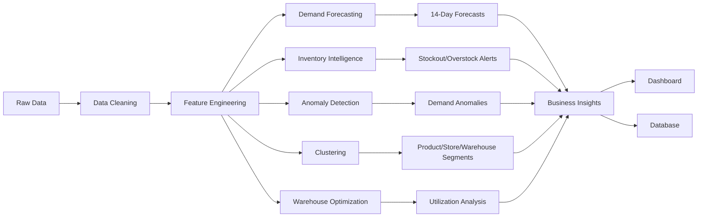

# RetailSync AI - ML Pipeline Architecture

## End-to-End Pipeline



## Pipeline Components

### 1. Data Ingestion (`src/data/`)
- `generate_dataset.py` — Synthetic retail data generation
- `ingest.py` — Data cleaning and validation

### 2. Database Layer (`src/database/`)
- `init_db.py` — SQLite database initialization
- `schema.sql` — Database schema
- `queries.sql` — Analytical SQL queries

### 3. Feature Engineering (`src/features/`)
- `feature_engineering.py` — 74 features including lags, rolling stats, time features, inventory features

### 4. Forecasting (`src/forecasting/`)
- `demand_forecaster.py` — Model training and evaluation
- `forecast_pipeline.py` — 14-day forecast generation

### 5. Inventory Intelligence (`src/inventory/`)
- `inventory_intelligence.py` — Stockout, overstock, dead stock detection
- `load_alerts.py` — Load alerts into database

### 6. Anomaly Detection (`src/anomaly/`)
- `anomaly_detection.py` — Ensemble anomaly detection (Z-score, IQR, Isolation Forest)

### 7. Clustering (`src/clustering/`)
- `segmentation.py` — Product, store, warehouse segmentation
- `warehouse_optimization.py` — Warehouse utilization analytics

### 8. Pipeline Orchestration (`src/pipeline/`)
- `run_pipeline.py` — End-to-end pipeline validation and summary

## Data Flow

```
data/raw/*.csv
    ↓ [ingest.py]
data/processed/*.csv
    ↓ [init_db.py]
database/retailsync.db
    ↓ [feature_engineering.py]
data/processed/features_daily.csv
    ↓ [demand_forecaster.py]
models/demand_forecaster.pkl
    ↓ [forecast_pipeline.py]
data/processed/forecasts_next_14d.csv
```

## Model Artifacts

| Model | File | Type | Purpose |
|-------|------|------|---------|
| Demand Forecaster | `models/demand_forecaster.pkl` | Baseline Mean | Predict future demand |
| Product Clusterer | `models/product_clusterer.pkl` | K-Means K=2 | Segment products |
| Store Clusterer | `models/store_clusterer.pkl` | K-Means K=2 | Segment stores |
| Warehouse Clusterer | `models/warehouse_clusterer.pkl` | K-Means K=4 | Segment warehouses |

## Database Tables

| Table | Records | Purpose |
|-------|---------|---------|
| products | 50 | Product catalog |
| stores | 10 | Store information |
| suppliers | 8 | Supplier data |
| warehouses | 5 | Warehouse information |
| sales | 69,216 | Sales transactions |
| inventory | 52,500 | Inventory snapshots |
| inventory_alerts | 785 | Stockout/overstock alerts |
| anomaly_flags | 31,619 | Demand anomalies |
| product_segments | 50 | Product clusters |
| store_segments | 10 | Store clusters |
| warehouse_segments | 5 | Warehouse clusters |
| warehouse_optimization | 5 | Utilization metrics |

## Reproducibility

```bash
# Complete pipeline execution order
python src/data/generate_dataset.py
python src/data/ingest.py
python src/database/init_db.py
python src/features/feature_engineering.py
python src/forecasting/demand_forecaster.py
python src/forecasting/forecast_pipeline.py
python src/inventory/inventory_intelligence.py
python src/inventory/load_alerts.py
python src/anomaly/anomaly_detection.py
python src/clustering/segmentation.py
python src/clustering/warehouse_optimization.py
python src/pipeline/run_pipeline.py
```

## Configuration

Pipeline configuration is stored in:
- `docs/pipeline_config.json` — Pipeline parameters and model settings
- `docs/pipeline_insights.json` — Business insights and metrics
- `docs/pipeline_summary.md` — Human-readable summary
